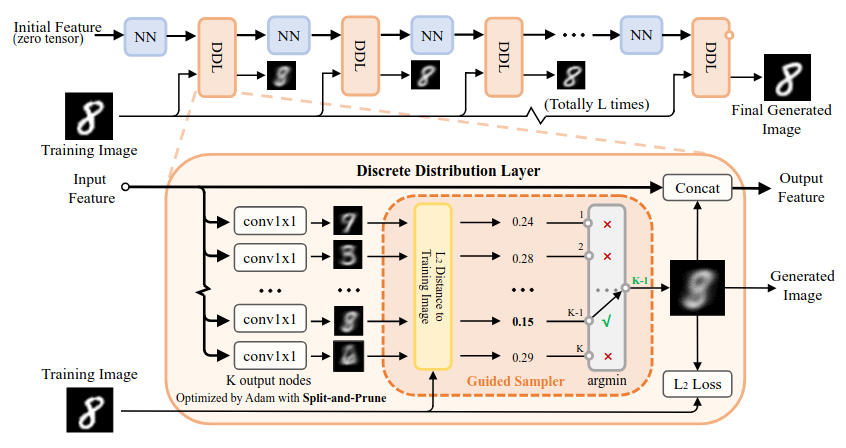
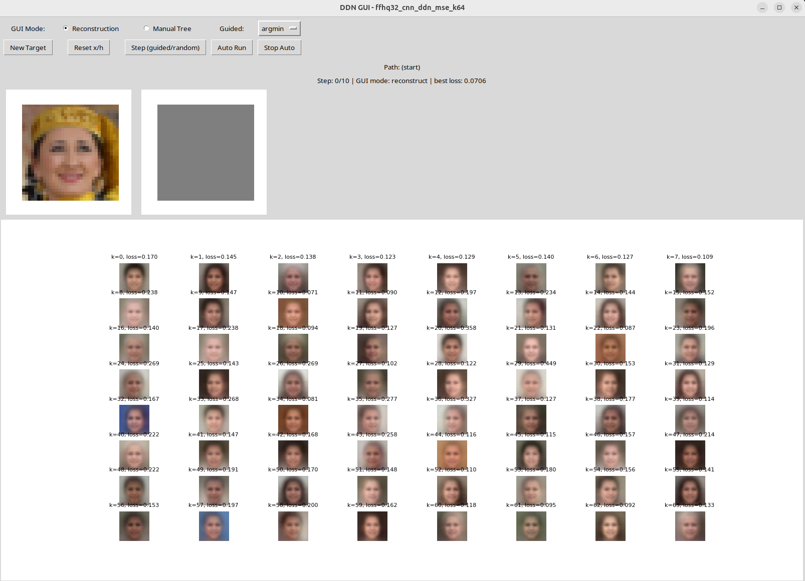

# Discrete Distribution Networks (DDN) - Experimental Implementation

This repository contains an experimental implementation of **Discrete Distribution Networks (DDN)**, a novel generative model introduced in the paper ["Discrete Distribution Networks"](https://arxiv.org/abs/2401.00036) (ICLR 2025). The focus is on the **Recurrence Iteration Paradigm**, where a single network with shared weights is applied iteratively to progressively refine image reconstructions.

---

## Table of Contents

- [Project Idea](#project-idea)
- [Related Work](#related-work)
- [Procedure](#procedure)
- [Results and Evaluation](#results-and-evaluation)
- [Installation](#installation)
- [Running Experiments](#running-experiments)
- [Interactive GUI](#interactive-gui)
- [Poster](#poster)
- [References](#references)

---

## Project Idea

Discrete Distribution Networks (DDN) represent a novel approach to generative modeling. Instead of mapping a latent vector to a single output, DDN generate **K discrete sample candidates** at each layer. By stacking **L** such layers and selecting the best candidate at each step (guided by proximity to a target), DDN build a hierarchical discrete distribution over the output space with **K^L** possible outcomes.

### Key Concepts

1. **Multiple Output Heads**: Each layer outputs K different image candidates simultaneously.
2. **Hierarchical Refinement**: The selected output from layer *l* becomes the input to layer *l+1* and thereby progressively refines the reconstruction.
3. **Tree-Structured Latent Space**: The sequence of selected indices `[k₁, k₂, ..., k_L]` forms a path through a K-ary tree and serves as a compact 1D latent representation.
4. **Split-and-Prune Optimization**: An evolutionary-inspired algorithm that balances the usage of output heads during training.

### Implementation Variants

Two modes have been implemented:

| Mode | Description |
|------|-------------|
| **`feature_image`** | The network receives both the current image and a persistent feature map. This approach follows the paper's design more closely. |
| **`image_only`** | A simplified variant where only the reconstructed image is fed back (no separate feature). This reduces complexity while still capturing the core DDN idea. |



---

## Related Work

DDN build upon and relate to several families of generative models:

- **Variational Autoencoders (VAEs)** and **VQ-VAE**: DDN share the concept of discrete representations with VQ-VAE but differ by not requiring an encoder or codebook. The hierarchical discrete latent in DDN is inherently tree-structured.

- **Diffusion Models**: While diffusion models iteratively denoise samples, DDN iteratively refine discrete choices through their hierarchical structure.

- **Idempotent Generative Networks (IGN)**: A recent alternative that trains networks to be idempotent. DDN differs by explicitly modeling discrete distributions.

For more details, see Section 2 of the [original paper](https://arxiv.org/abs/2401.00036).

---

## Procedure

### Training Process

1. **Initialization**: Start with a zero tensor (or noise) as the initial image `x₀`.
2. **Forward Pass**: At each layer *l*, the network outputs K candidate images.
3. **Selection**: The candidate closest to the ground truth (by L2 or BCE loss) is selected.
4. **Iteration**: The selected image becomes input to the next layer.
5. **Loss Computation**: Average reconstruction loss across all layers.

### Split-and-Prune Algorithm

To prevent "dead" output heads and balance the discrete distribution:

- **Split**: If a head is selected too frequently (> `P_split`), clone it with small noise.
- **Prune**: If a head is rarely selected (< `P_prune`), remove it and reinitialize.

### Training Strategies

| Strategy | Description |
|----------|-------------|
| `naive` | Always select the best (argmin loss) candidate |
| `softmax` | Soft selection using softmax weights over losses |
| `split_prune` | Naive selection + Split-and-Prune balancing |

### Chain Dropout

To prevent overfitting on specific paths through the tree, each layer randomly replaces the guided selection with a random choice at probability `chain_dropout_prob`.


---

## Results and Evaluation

### Datasets

Experiments were conducted on:

- **MNIST** (28×28, grayscale)
- **CIFAR-10** (32×32, RGB)
- **FFHQ** (resized to 32×32 or 64×64, RGB)

### Reconstruction Quality

The model learns to reconstruct images through the hierarchical selection process:


### Generation via Random Sampling

For generation, replace the guided sampler with random selection at each layer:


### Training Curves

Loss curves showing training and validation loss over epochs:


### Comparison: Image-Only vs Feature-Image Mode

| Mode | CIFAR-10 Val Loss | Notes |
|------|-------------------|-------|
| `feature_image` | *TBD* | Carries persistent feature state |
| `image_only` | *TBD* | Simplified, image-only feedback |


### Tree Exploration

The GUI allows interactive exploration of the generation tree:



---

## Installation

### Setup

```bash
# Clone the repository
git clone https://github.com/yourusername/ddn-experiments.git
cd ddn-experiments

# Create virtual environment (optional but recommended)
python -m venv venv
source venv/bin/activate  # On Windows: venv\Scripts\activate

# Install dependencies
pip install -r requirements.txt
```

### Datasets

#### Automatic Downloads

**MNIST** and **CIFAR-10** datasets are downloaded automatically when running the training script for the first time. No manual setup is required.

#### FFHQ Dataset (Manual Download Required)

The FFHQ dataset must be downloaded manually from Kaggle:

**Download Link:** [https://www.kaggle.com/datasets/rahulbhalley/ffhq-256x256](https://www.kaggle.com/datasets/rahulbhalley/ffhq-256x256)

#### Setup Instructions

1. Download the dataset from Kaggle (requires a Kaggle account)
2. Extract the archive
3. Place the PNG images in the following directory structure:

```
data/
└── ffhq/
    └── images256x256/
        ├── 00000.png
        ├── 00001.png
        ├── 00002.png
        └── ... (all 70,000 images)
```

The config files expect the images to be located at `./data/ffhq/images256x256/`. If you place them elsewhere, update the `root` parameter in the FFHQ config files accordingly:

```yaml
dataset:
  name: ffhq
  root: ./data/ffhq/images256x256  # <- Update this path if needed
```

> **Note:** The original FFHQ images are 256×256 pixels. The training script will automatically resize them to the resolution specified in the config (e.g., 32×32 for the provided configs).

---

## Running Experiments

### Training a Single Model

```bash
python train_ddn.py --config configs/mnist_mlp_feature_image_bce_k8.yaml
```

This will:
1. Load the configuration from the YAML file
2. Download/load the dataset
3. Train the model
4. Save the best checkpoint and results to the output directory

### Configuration Files

Example configs are provided in the `configs/` directory:

| Config | Dataset | Architecture | Mode |
|--------|---------|--------------|------|
| `mnist_mlp_image_only_bce_k8.yaml` | MNIST | MLP | image_only |
| `mnist_mlp_feature_image_bce_k8.yaml` | MNIST | MLP | feature_image |
| `cifar_cnn_ddn_image_only_mse_k64.yaml` | CIFAR-10 | CNN (UNet-like) | image_only |
| `cifar_cnn_ddn_mse_k64.yaml` | CIFAR-10 | CNN (UNet-like) | feature_image |
| `ffhq32_cnn_ddn_image_only_mse_k64.yaml` | FFHQ | CNN (UNet-like) | image_only |
| `ffhq32_cnn_ddn_mse_k64.yaml` | FFHQ | CNN (UNet-like) | feature_image |

### Running Multiple Experiments

To run all experiments defined by config files:

```bash
python run_experiments.py --configs_glob "configs/*.yaml" --results_csv experiments_summary.csv
```

This will:
1. Find all YAML configs matching the glob pattern
2. Train each model sequentially
3. Collect results into a summary CSV file

### Key Configuration Parameters

```yaml
model:
  mode: feature_image    # or "image_only"
  arch: cnn_ddn          # "mlp", "cnn_simple", or "cnn_ddn"
  K: 64                  # Number of output candidates per layer
  L: 10                  # Number of layers (iterations)

training:
  loss_type: mse         # "mse" or "bce"
  training_strategy: split_prune  # "naive", "softmax", or "split_prune"
  chain_dropout_prob: 0.05
  epochs: 50
  learning_rate: 1e-4
```

---

## Interactive GUI

The GUI (`ddn_gui.py`) provides an interactive way to explore the DDN tree structure and observe how different branch selections affect the output.

### Launching the GUI

```bash
python ddn_gui.py --config configs/mnist_mlp_feature_image_bce_k8.yaml --weights experiments/mnist_mlp_feature_image_bce_k8/best_mnist_mlp_feature_image_bce_k8.pth
```

If `--weights` is not specified, it will look for the best checkpoint in the default output directory.

### GUI Features

| Feature | Description |
|---------|-------------|
| **Target Image** | Randomly sampled from the test set |
| **Current Reconstruction** | The current state after selected branches |
| **Candidate Grid** | K candidates to choose from at the current step |
| **Path Display** | Shows the sequence of selected branch indices |
| **Reconstruction Mode** | Automatically selects the best (lowest loss) candidate |
| **Manual Mode** | Click on candidates to manually explore the tree |
| **Auto Run** | Automatically steps through L layers |

### GUI Controls

- **New Target**: Sample a new target image from the test set
- **Reset x/h**: Reset to initial state (step 0)
- **Step**: Perform one guided or random step
- **Auto Run**: Continuously step until reaching layer L
- **Stop Auto**: Stop the auto-run process
- **Click on Candidate**: (In Manual mode) Select that branch


---

## Poster

The poster below summarizes the project and was created for a presentation:


---

## Project Structure

```
ddn-experiments/
├── configs/
│   ├── mnist_mlp_image_only_bce_k8.yaml
│   ├── mnist_mlp_feature_image_bce_k8.yaml
│   ├── cifar_cnn_ddn_image_only_mse_k64.yaml
│   ├── cifar_cnn_ddn_mse_k64.yaml
│   ├── ffhq32_cnn_ddn_image_only_mse_k64.yaml
│   └── ffhq32_cnn_ddn_mse_k64.yaml
├── experiments/           # Output directory for trained models
├── images/                # Images for README
│   └── poster.jpg
├── train_ddn.py           # Main training script
├── ddn_gui.py             # Interactive GUI
├── run_experiments.py     # Batch experiment runner
└── README.md
```

---

## References

- **Original Paper**: Lei Yang, "Discrete Distribution Networks", ICLR 2025. [arXiv:2401.00036](https://arxiv.org/abs/2401.00036)
- **Official Project Page**: [https://discrete-distribution-networks.github.io/](https://discrete-distribution-networks.github.io/)

---